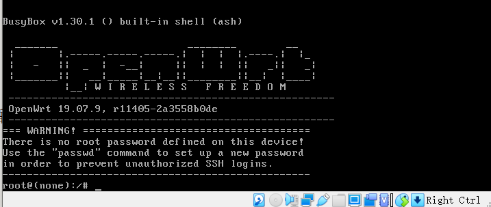

# openwrt环境配置

## 实验环境

- virtualbox  6.1.30
- Ubuntu 20.04 Server
- Openwrt  19.07.9

## 实验要求

- 配置的固件可以开源下载，然后编译，也可以直接下载编译好的固件；

- 有条理地描述安装环境、条件、过程，遇到的问题及解决方案，学习总结等；

- 安装过程截图，测试页面截图；

- 郑重提示：严禁直接网上截图。

## 实验流程

### 下载Openwrt镜像并配置虚拟机

- 在https://downloads.openwrt.org/releases/19.07.9/targets/x86/64/openwrt-19.07.9-x86-64-combined-squashfs.img.gz下载镜像压缩包，在本地使用7z即可解压缩。

- ``` VBoxManage convertfromraw --format VDI openwrt-19.07.9-x86-64-combined-squashfs.img openwrt-19.07.9-x86-64-combined-squashfs.vdi```

- 使用以上命令进行格式转换，出现如下报错：

- ```
  VBoxManage.exe: error: VD: The given disk size 20408912 is not aligned on a sector boundary (512 bytes)
  VBoxManage.exe: error: Cannot create the disk image "openwrt-19.07.9-x86-64-combined-squashfs.vdi": VERR_VD_INVALID_SIZE
  ```

- 按照官网教程先整合img镜像(使用git bash)：```dd if=openwrt-19.07.9-x86-64-combined-squashfs.img of=lede.img bs=128000 conv=sync```

- 再执行：``` VBoxManage convertfromraw --format VDI lede.img openwrt-19.07.9-x86-64-combined-squashfs.vdi```

- 得到vdi镜像。

- 新建虚拟机选择「类型」 Linux / 「版本」Linux 2.6 / 3.x / 4.x (64-bit)，填写有意义的虚拟机「名称」；

- 内存设置为 256 MB；

- 使用已有的虚拟硬盘文件 - 「注册」新虚拟硬盘文件选择刚才转换生成的 .vdi 文件。

- 第一块网卡设置为：Intel PRO/1000 MT 桌面（仅主机(Host-Only)网络）；

- 第二块网卡设置为：Intel PRO/1000 MT 桌面（网络地址转换(NAT)）。

### 配置网络设置

- 打开虚拟机:

  

- 编辑 `/etc/config/network` 配置文件来设置好远程管理专用网卡的 IP 地址。如下配置片段所示，修改 OpenWrt 局域网地址为当前 Host-only 网段内可用地址，只需要修改 `option ipaddr` 的值即可。

  ```shell
  config interface 'lan'
  option type 'bridge'
  option ifname 'eth0'
  option proto 'static'
  option ipaddr '192.168.56.11' 
  option netmask '255.255.255.0'
  option ip6assign '60'
  ```

  修改完网络配置之后，可以通过 `ifdown eth0 && ifup eth0` 完成指定网卡 `eth0` 的重新加载配置生效无需重新启动系统。如果遇到 `ifdown` 或 `ifup` 指令无效的情况，可以重启系统以使新的网络配置生效。

## 参考资料

- [新版openwrt安装到Ubuntu](https://openwrt.org/docs/guide-user/virtualization/virtualbox-vm)

- [课本](https://c4pr1c3.gitee.io/cuc-mis/chap0x01/exp.html)

  