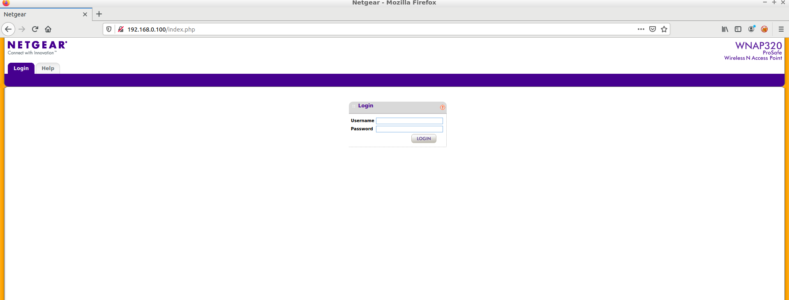

# 路由器漏洞分析之 CVE-2016-1555

## 实验要求

选取参考链接（或自行搜索）页面中任意一个路由器、摄像头或者其它智能设备的固件漏洞，对目标固件进行逆向工程和漏洞分析，剖析漏洞机理，找到漏洞利用方法，编写漏洞利用代码，展示漏洞利用效果，简述漏洞防护方法。具体要求：

1、全程记录过程，形成文档，文件名中标明漏洞的CVE编号。

2、提交文件，压缩包中包含固件、源代码等。

3、可借鉴他人思路和方法，坚决杜绝全文拷贝。

## 实验环境

- AttifyOS v3.0
- virtualbox  6.1.30 r148432 (Qt5.6.2)

## 实验流程

### 漏洞简介

NVD的漏洞描述(https://nvd.nist.gov/vuln/detail/CVE-2016-1555)如下：

(1) boardData102.php, (2) boardData103.php, (3) boardDataJP.php, (4) boardDataNA.php, and (5) boardDataWW.php in Netgear WN604 before 3.3.3 and WN802Tv2, WNAP210v2, WNAP320, WNDAP350, WNDAP360, and WNDAP660 before 3.5.5.0 allow remote attackers to execute arbitrary commands.

即，在上述固件中的上述php文件中，存在明显的远程代码执行漏洞。

本次漏洞复现实验选取的固件版本为：WNAP320

### 搭建虚拟环境

```shell
# 使用Firmware-analysis-toolkit集成工具
./fat.py WNAP320\ Firmware\ Version\ 2.0.3.zip 
```


记下虚拟环境的登入口IP地址：192.168.0.100



虚拟环境搭建完成。

### 漏洞分析

使用binwalk解包固件：

```
binwalk -Me WNAP320\ Firmware\ Version\ 2.0.3.zip 
# -Me 表示递归分解
```

得到文件如下图所示：


发现这是一个 `squashfs` 文件系统，里面是标准的 `linux` 目录结构，所以这个固件应该是基于 `linux` 做的。

根据NVD中的简介可以得知，这些含有漏洞的PHP文件很有可能是在/home/www/文件目录下：

```shell
iot@attifyos ~/t/f/_/_/_/s/h/www> ls
background.html   data.php            login_header.php   support.link
BackupConfig.php  downloadFile.php    login.php          templates/
boardDataNA.php   getBoardConfig.php  logout.html        test.php
boardDataWW.php   getJsonData.php     logout.php         thirdMenu.html
body.php          header.php          monitorFile.cfg    thirdMenu.php
button.html       help/               packetCapture.php  titleLogo.php
checkConfig.php   images/             recreate.php       tmpl/
checkSession.php  include/            redirect.html      UserGuide.html
clearLog.php      index.php           redirect.php
common.php        killall.php         saveTable.php
config.php        login_button.html   siteSurvey.php

```

查看boardDataWW.php：```vim boardDataWW.php ```

文件内容如下所示（仅展示部分与漏洞相关的）：

```php
<?php
	$flag=false;
	$msg='';
	if (!empty($_REQUEST['writeData'])) {
		if (!empty($_REQUEST['macAddress']) && array_search($_REQUEST['reginfo'],Array('WW'=>'0','NA'=>'1'))!==false && ereg("[0-9a-fA-F]{12,12}",$_REQUEST['macAddress'],$regs)!==false) {
			//echo "test ".$_REQUEST['macAddress']." ".$_REQUEST['reginfo'];
			//exec("wr_mfg_data ".$_REQUEST['macAddress']." ".$_REQUEST['reginfo'],$dummy,$res);
			exec("wr_mfg_data -m ".$_REQUEST['macAddress']." -c ".$_REQUEST['reginfo'],$dummy,$res);
			if ($res==0) {
				conf_set_buffer("system:basicSettings:apName netgear".substr($_REQUEST['macAddress'], -6)."\n");
				conf_save();
				$msg = 'Update Success!';
				$flag = true;
			}
		}
		else
			$flag = true;
	}

?>
```

可以看到关于“macAddress”所做的限制仅限在了客户端，远远是不够的。

### 漏洞复现

#### 获取默认用户名及密码

```
# vim login.php
$passStr = conf_get("system:basicSettings:adminPasswd");
    	$str = explode(' ',$passStr);
	$str[1] = str_replace('\:',':',$str[1]);
	//$str[1] = str_replace('\\ ',' ',$str[1]);
	//$str[1] = str_replace('\\\\','\\',$str[1]);
    //$str[1] = 'password';
	
    if ($_REQUEST['username'] == 'admin' && htmlentities($_REQUEST['password']) == htmlentities($str[1])) {
    	if (checkSessionExpired()===false) {
    		echo 'sessionexists';
    	}
```

猜测用户名和密码分别为：admin,password；

测试发现还真是：


#### PHP注入

由于我们之前看到的漏洞文件是boardDataWW.php，于是尝试访问这个URL：


看到了一个提交MAC地址的窗口，我们接下来只需要在网页端填上符合条件的MAC地址，使用burpsuite捕获并修改这一参数即可。

填上“111111111111”并提交，被监听着的burpsuite捕获：


注意到我们提交的MAC地址参数和响应时间为57ms；

利用响应时间进行测试，看能不能成功注入：


MAC地址对应的参数被我们加上了```;sleep+5+#```，如果成功注入，那么响应时间会在原来的基础上多5s即5000ms左右——事实也正是如此，说明利用这个漏洞能成功注入。

#### 远程代码执行

在原有的MAC地址参数后加入我们需要执行的命令：

```;cp+/etc/passwd+./passwd/html+#```


可以看到成功执行了该命令，漏洞复现完成。

### 预防方法

这个其实是老生常谈了，数据检查不仅仅应该在客户端执行，也要在服务器端执行。

## 参考资料

- https://nvd.nist.gov/vuln/detail/CVE-2016-1555

