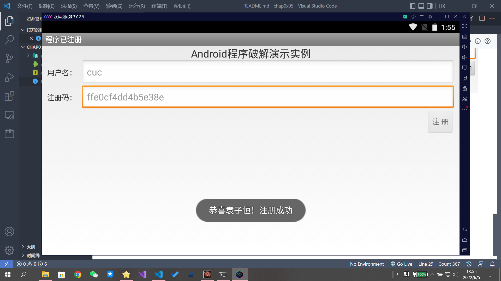

# 安卓逆向基础

[toc]

## 实验要求

1、对附件中的apk文件，逆向工程后，找出用户名和密码

2、破解成功后，重新生成apk，弹出一个提示的信息，信息包括自己的姓名。

3、全程记录破解过程，完成实验报告。

## 实验环境

* Androidkiller v1.3.1.0
* 夜神模拟器 v7.0.2.9
* jdk 1.8.0_261

## 实验流程

### 找到用户名和注册码

在strings.xml中查找到用户名和注册码的参数名：


进入程序入口：MainActivity.smail;

在工程搜索中搜索“userName”，果然得到相关函数"checkSN"：


p1,p2都是用户输入的数据，我们需要找的是内置的注册码。


在这里v6这个寄存器的值就是内置的注册码，因为我们能看到他与用户输入的注册码进行了比较（相等返回true，否则返回false，不区分大小写）。

我们要做的其实很简单，把这个v6寄存器的值打印出来，输出在日志上就行了。

因此需要一个额外的寄存器存放这个值，在checkSN函数一开始的地方声明了使用10个本地寄存器，我们将其改为11个：


```smail
# 在equalsIgnoreCase调用前加上
const-string v11, "vvvvvvvv"
invoke-static {v11,v6}, Landroid/util/Log;->d(Ljava/lang/String;Ljava/lang/String;)I
```

编译并在模拟器上安装运行（通过adb连接）。

```
.\adb.exe connect 127.0.0.1:62001
adb server is out of date.  killing...

* daemon started successfully *
  connected to 127.0.0.1:62001
```

随便输一个16位的注册码并提交：


得到日志：


注册码就是 ``ffe0cf4dd4b5e38e``。

### 弹出提示

第二个提示弹出（带自己姓名就更简单了），注意到注册成功以后会弹出“恭喜你！注册成功”，在反汇编中的String.xml中把这个字符串改成如下图所示，即可编译运行。




最终的apk文件可见：[crackme02_killer.apk](./crackme02_killer.apk)
