# 移动互联网安全大作业——CTF Android Reverse&应用破解

[toc]

## 20150CTF-EasyRe

### 0x01环境及工具

* 夜神模拟器 7.0.2.9
* Androidkiller v1.3.1
* jadx-gui-1.1.0
* jdk1.8.0_261
* [easyre.apk](./easyre.apk)

### 0x02查看apk

安装到模拟器以后打开看一下大概是个什么样的：

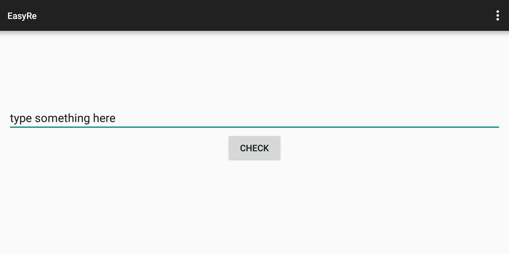

随便输入一串字符点击CHECK得到的提示如下图所示：

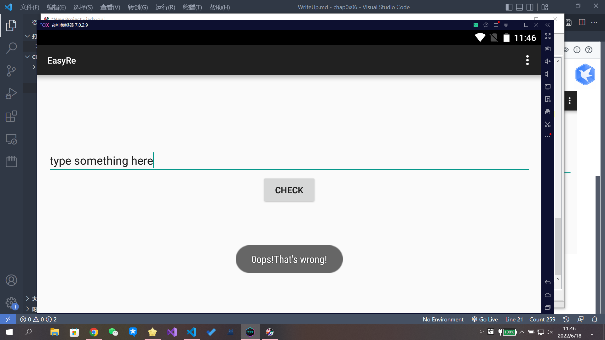

### 0x03分析文件结构及反编译代码

使用jadx打开apk文件，很容易发现如下的函数：

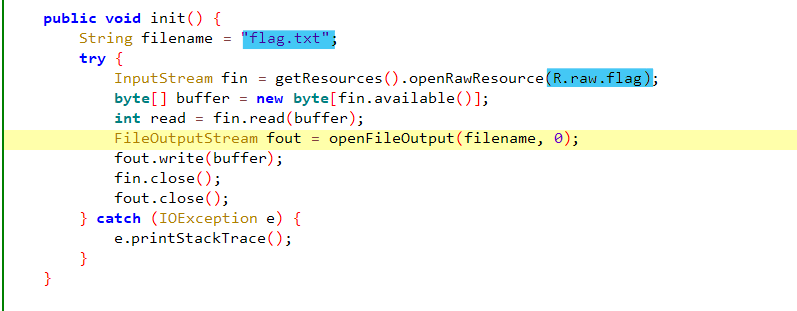

可以看到直接读取了 ``flag.txt``中的字符串，且这个txt文件的路径也给出了，即：

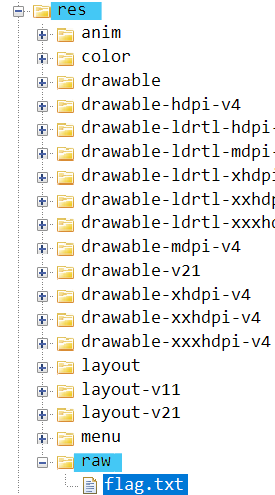

打开这个文件立马得到：

```
0ctf{Too_Simple_Sometimes_Naive!!!}
```

flag确实表达了这一条是错误flag的意思，但是我们还是尝试一下，结果果然是错的，那么这一条思路就中断了。

我们只能继续分析代码逻辑。

根据错误提示的字符串可以找到对输入字符进行比对的函数 ``OnClick``：

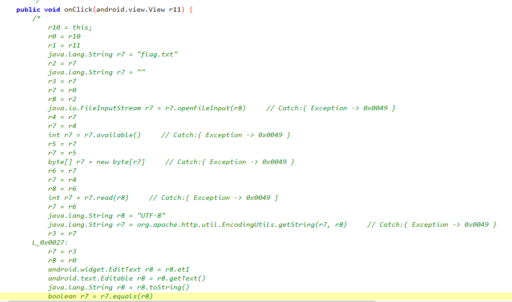

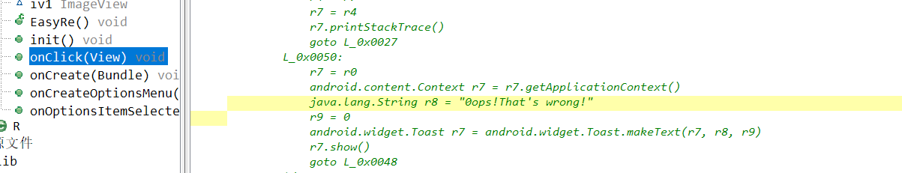

可以看到把"flag"读入以后几乎没做操作就直接比较了，理论上我们输入这个flag应该是直接通过的。因此合理推测，存在hook操作改写了某一个基本操作函数。

发现了一个so文件，于是尝试用IDA(32bit)打开：

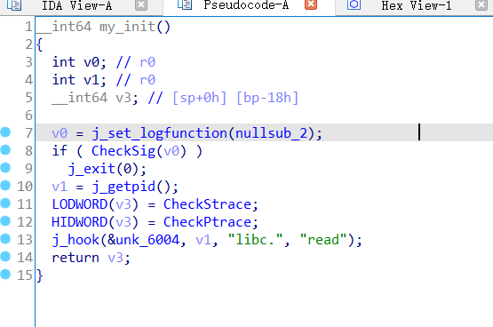

发现了一个 ``my_init()``函数，通过变量名可知确实使用了hook技术，且修改的函数为 ``read``函数。

而之前比较前恰恰调用过 ``read``函数：

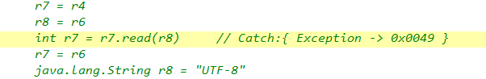

因此可以断定之前的猜测是正确的。

通过寻找终于找到了如下代码：

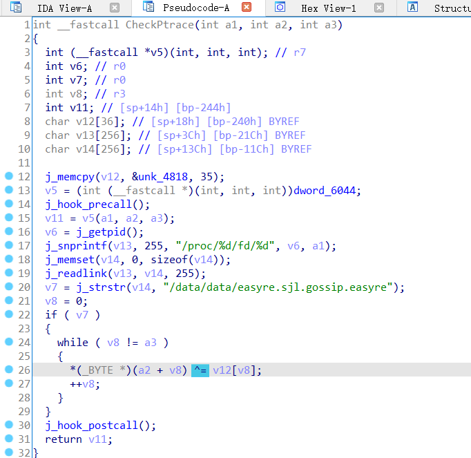

有一个相当令人注目的对字符串的异或（``^=``）操作。

前面有一个 `v5`，其中的两个参数用在了后面的异或操作中，`v3`可能是某数组的起始地址，`v10`可能是长度。

再进一步猜测，它就是 `read()`

想到这里，我们把 `dest[]`数组从so文件里拷贝出来：

```
unsigned AnsiChar data[35] = {
	0x00, 0x00, 0x00, 0x00, 0x00, 0x1D, 0x1B, 0x48, 0x2C, 0x0C, 0x24, 0x02, 0x02, 0x09, 0x3A, 0x0B,
	0x3B, 0x0E, 0x03, 0x3A, 0x39, 0x0C, 0x08, 0x11, 0x00, 0x00, 0x1A, 0x09, 0x0C, 0x29, 0x20, 0x58,
	0x44, 0x00, 0x00
};
```

这里可以猜测，我们输入的字符串先和dest[]异或运算再与"flag"比较，因此要得到真正的 ``flag``只要做"flag"与dest[]的异或就行了。

脚本如下[demo.py](.\demo.py)：

```python
# coding = utf-8

data = [
    0x00, 0x00, 0x00, 0x00, 0x00, 0x1D, 0x1B, 0x48, 0x2C, 0x0C, 0x24, 0x02, 0x02, 0x09, 0x3A, 0x0B, 
    0x3B, 0x0E, 0x03, 0x3A, 0x39, 0x0C, 0x08, 0x11, 0x00, 0x00, 0x1A, 0x09, 0x0C, 0x29, 0x20, 0x58, 
    0x44, 0x00, 0x00]

old_flag = "0ctf{Too_Simple_Sometimes_Naive!!!}"

def main():
    flag = []
    for i in range(len(old_flag)):
        flag.append(chr(ord(old_flag[i]) ^ data[i]))
    print ("".join(flag))

if __name__ == '__main__':
    main()
```

运行结果为：

```
0ctf{It's_More_Than_Meets_The_Eye!}
```

### 0x04参考资料

* [一篇文章带你理解HOOK技术](https://bbs.pediy.com/thread-251412.html)
* [so介绍](https://ctf-wiki.org/android/basic_operating_mechanism/native_layer/so/)
* [Android关键代码定位](https://ctf-wiki.org/android/basic_reverse/android_code_location/)

## 应用破解之滑雪大冒险2

### 0x01环境及工具

* 夜神模拟器 7.0.2.9
* Androidkiller v1.3.1
* jadx-gui-1.1.0
* jdk1.8.0_261
* 原文件：[2.apk](./2.apk)

### 0x02应用分析与破解

首先先玩一会看看这个游戏是怎么样回事的：

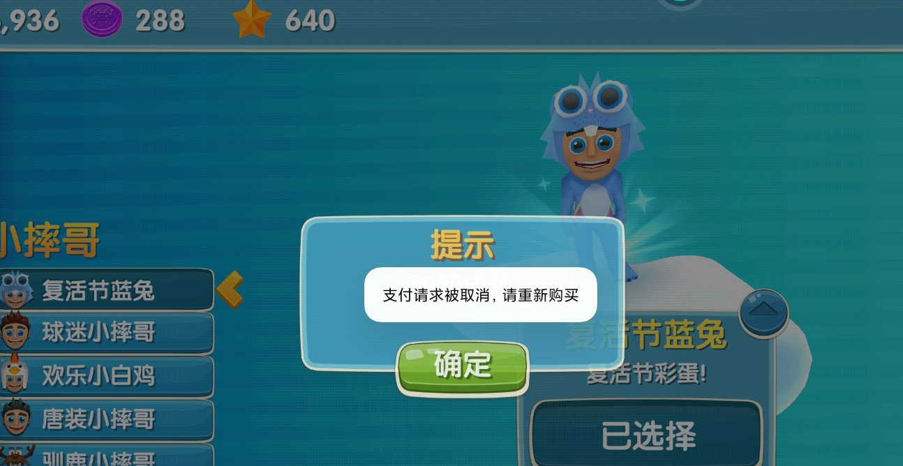

可以看到内购内容，如图显示的是支付失败时弹出的窗口。

接下来使用Androidkiller打开apk文件，搜索字符串“购买”，得到如下搜索结果：

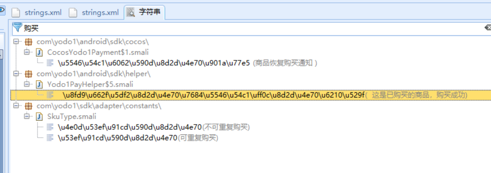

显然这个“这是已购买的商品，购买成功”字符串意义非凡。

跳转到这一字符串所在文件位置，并把smail文件转化为java格式。

```java
switch (paramInt2)
              {
              default: 
                switch (paramInt2)
                {
                default: 
                  paramInt1 = 0;
                  break;
                case 302: 
                case 303: 
                case 304: 
                  YLog.d("Yodo1PayHelper,支付更换支付方式errorCode");
                  paramInt1 = 0;
                }
                break;
              case 203: 
                paramInt1 = 203;
                break;
                paramInt1 = 3;
                break;
                YLog.d("Yodo1PayHelper", "  这是已购买的商品，购买成功");
                paramInt1 = 1;
                break;
              case 204: 
                paramInt1 = 207;
                break;
              }
            }
            else
            {
              paramInt1 = 205;
            }
          }
          else {
            paramInt1 = 0;
          }
          this.this$0.purchased(paramInt1, this.val$channelPayInfo.getOrderId(), this.val$productData, this.val$payType);
        }
      }
      else
      {
        Yodo1PayHelper.access$200(this.this$0, this.val$activity);
        Yodo1PayHelper.access$900(this.this$0, this.val$activity, this.val$productData.getOrderId());
        if (paramInt2 == 208)
        {
          YLog.d("Yodo1PayHelper", "  这是已购买的商品，购买成功");
          this.this$0.purchased(1, this.val$channelPayInfo.getOrderId(), this.val$productData, this.val$payType);
        }
        else
        {
          this.this$0.purchased(2, this.val$channelPayInfo.getOrderId(), this.val$productData, this.val$payType);
          Yodo1PayHelper.access$700(this.this$0, this.val$productData, null, String.valueOf(paramInt2), paramString);
        }
      }
    }
    else
    {
      YLog.d("Yodo1PayHelper", " 正在查询订单状态");
```

不难发现，两个重要的字符串对应的参数 ``paramInt2==208``，因此我们的思路就是把这一参数值在比较操作前都改为208。

又发现：

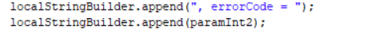

所以只需要在smail文件中搜索 ``errorCode``这个变量就行了。

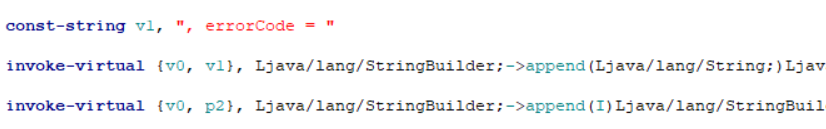

发现 ``errorCode``的值即为 ``p2``。

因此我们需要对 ``p2``进行赋值。（208的16进制值为d0）

所以我们要插入的代码为：``const/16 p2,0xd0``

插入位置在对变量 ``p2``的所有比较前即可，如下图：

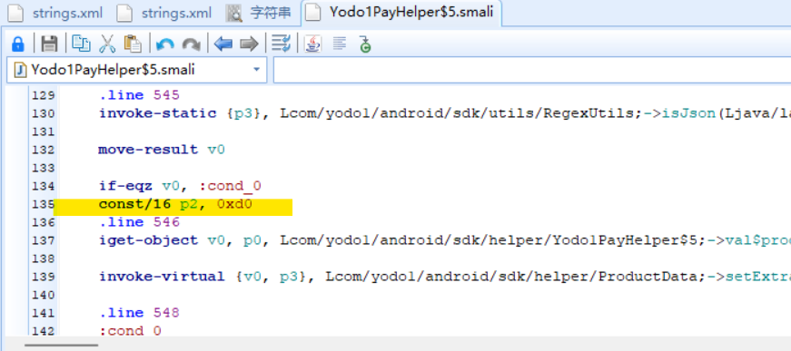

签名编译即可安装。

安装后打开游戏发现已经破解：


破解安装包为：[2_killer.apk](./2_killer.apk)
